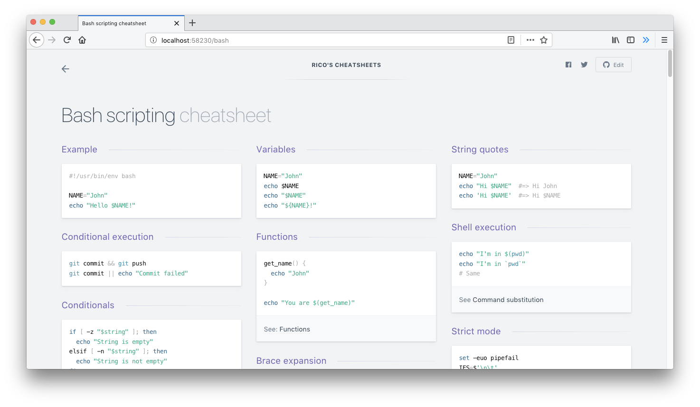

# Repodevs

> TL;DR for Odoo, Python and Web Developer documentation

 

 
✨ <b><a href='https://tldr.repodevs.com/'>tldr.repodevs.com</a></b> ✨

 

---

See [CONTRIBUTING.md](CONTRIBUTING.md) for developer notes.

---

This cheatsheets is inspired from [https://devhints.io](https://devhints.io), I'm rewrite for cheatsheets that I have.
